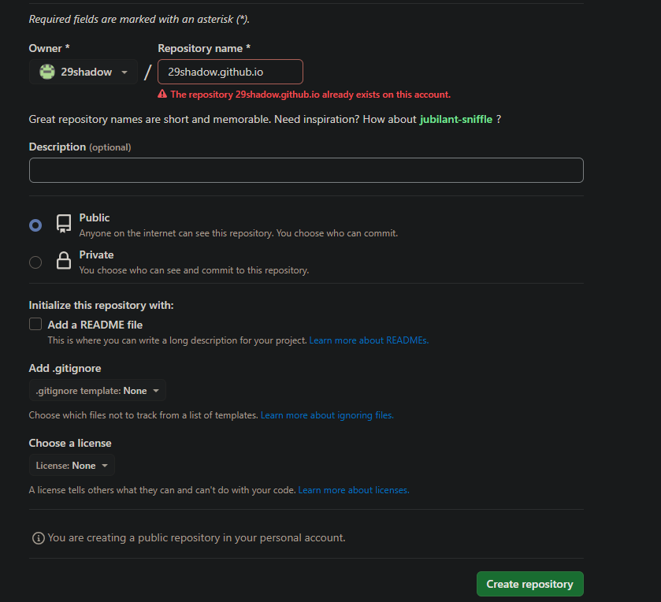

### step1:创建github仓库

```
在Github上创建一个以yourname.github.io为名字的仓库，在填写地址的时候注意，这个地址是就是你的域名，以github.io结尾
```



### step2:安装Hexo

```shell
$ mkdir hexo
$ cd hexo
$ npm install -g hexo-cli

注意：需要先安装npm和node.js环境
```


### step3:搭建博客

```shell
$ hexo init myblog # myblog博客项目名称
$ cd myblog
$ npm install
```

新建完成后，生成如下目录

```
myblog/ 
|-- node_modules/   # 放置npm的包
|-- scaffolds/      # 储存文章模板
|-- source/			# 储存文章和部分资源
|-- themes/			# 储存主题
|-- _config.xxx.yml # 是肢体的plus版配置文件（xxx须更改文主题名）
|-- _config.yml		# hexo的主要配置文件
|-- package.json    # npm依赖的包json
|-- package-lock.json
```


```shell
#生成静态文件
$ hexo g 

https://blog.csdn.net/qq_34243930/article/details/109046120
https://blog.csdn.net/kantaiyang/article/details/129159055
https://blog.csdn.net/time888/article/details/70249241
https://www.cnblogs.com/bzsheng/p/13802829.html
```


Hexo实现多端同步

```
多客户端实现
```

